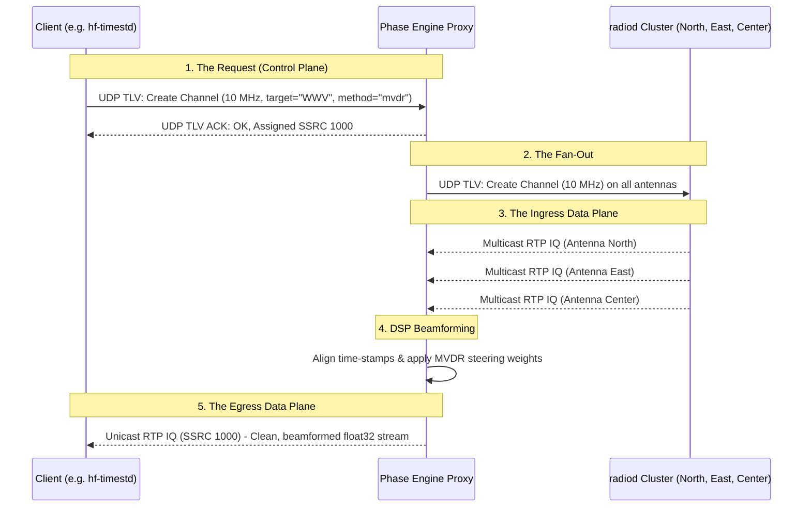

# Phase Engine

**Date:** 2026-02-28  
**Version:** 1.0.1  

**Phase Engine** is a high-performance middleware daemon that transforms an array of independent `ka9q-radio` SDR receivers into a coherent, steerable phased array. 

It implements a transparent **Proxy Architecture**: to any downstream client (like `hf-timestd` or `SWL-ka9q`), Phase Engine looks and behaves exactly like a physical `radiod` receiver. However, when a client requests a frequency, Phase Engine intercepts the command, fetches the raw IQ streams from all physical antennas simultaneously, performs complex spatial beamforming (MVDR, MRC, etc.), and seamlessly pushes a single, high-SNR output stream back to the client.

## System Architecture

Phase Engine operates as a "middlebox" transparently closing the loop between the client application and the physical SDRs.



### The Control Plane (The Proxy)
- **Status Multicaster**: Broadcasts fake JSON status packets on port `5006` so clients auto-discover `phase-engine` as an available radio.
- **TLV Server**: Listens for standard `ka9q-radio` commands. When it receives a request, it maps it to an internal "Virtual Channel" and passes the raw frequency requests down to the physical `radiod` cluster.

### The Data Plane (DSP & Egress)
- **Ingress**: Pulls raw `complex64` RTP streams from the physical radios.
- **DSP Combiner**: Uses the geographic location of the transmitter and the local array geometry to calculate steering vectors and combine the streams.
- **Egress**: Packages the mathematically combined `numpy` array back into standard RTP UDP packets and pushes them to the client.

## Features

- **Transparent Integration**: Clients using `ka9q-python` require zero modification to use basic spatial combining. 
- **Extended Spatial API**: Clients that *are* aware of Phase Engine can append geographic extensions to their requests:
  ```python
  # Standard ka9q-python channel creation
  channel = control.create_channel(
      frequency_hz=10e6,
      preset="iq",
      # Phase Engine spatial extensions:
      reception_mode="focus",    # Beam toward target
      target="WWV",              # Station name or Lat/Lon
      null_targets=["BPM"],      # Interference to null
      combining_method="mvdr",   # Use Capon beamforming
  )
  ```
- **Supported DSP Methods**:
  - `mrc` (Maximum Ratio Combining): Optimal for white-noise dominant environments.
  - `egc` (Equal Gain Combining): Aligns phases but ignores amplitude.
  - `selection`: Simply selects the antenna with the highest raw SNR.
  - `focus` / `beamform`: Standard delay-and-sum spatial matched filter.
  - `mvdr` / `adaptive`: Minimum Variance Distortionless Response. Forces a deep null on interference while maintaining unity gain on the target.

## Setup & Configuration

1. **Define your array geometry** in `phase-engine.toml`. Antenna positions are specified in meters relative to the phase center (ENU coordinate system).
2. **Specify your QTH** (latitude/longitude) so the engine can accurately calculate true geographic bearings to shortwave transmitters.
3. Start the daemon:
```bash
phase-engine daemon --config config/phase-engine.toml
```

## Array Pattern Visualization Tool

Phase Engine includes a built-in CLI tool to generate high-resolution polar plots of your theoretical array radiation pattern based on your physical layout and DSP configuration.

```bash
# Plot the MVDR beam pattern targeting WWV while nulling BPM
phase-engine plot --config config/phase-engine.toml \
                  --freq 10e6 \
                  --method mvdr \
                  --target "WWV,40.6780,-105.0470" \
                  --null "BPM,34.9500,109.5330" \
                  --out pattern_wwv.png
```

For detailed mathematical documentation on the Geographic Bearing and Steering Vector logic, see `docs/GEOMETRY_MATH.md`.
