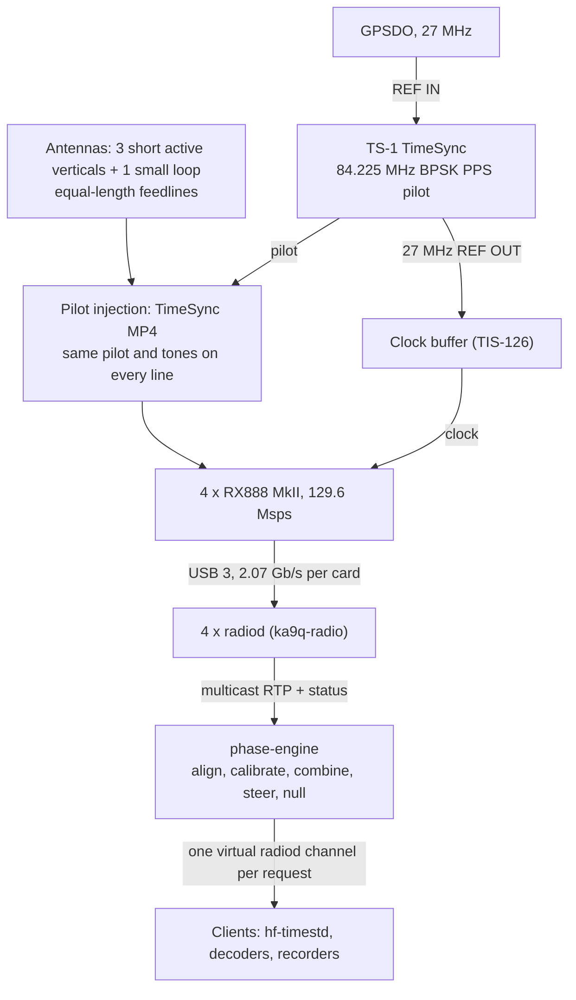

# Multi-Antenna Phasing with a Shared Pilot: Plan

Date: 2026-10-06
Status: plan. Supersedes the calibration approach in
[PHASE_COHERENCE_ARCHITECTURE.md](PHASE_COHERENCE_ARCHITECTURE.md).

phase-engine set out in March 2026 to make several RX888 receivers act as one
coherent array. Every receiver shared a GPSDO reference, and nothing else, so the
code could align the receivers only on the incoming signal. That alignment absorbs
the phase that carries an arrival's direction, which left fade-reducing diversity
as the only working mode. One thing has changed since. A TS-1 timing pilot, injected
identically into every receiver through a TimeSync MP4, now gives the array one known
signal that passes through each receiver's own chain. The pilot measures each
receiver's phase without touching the sky's. That separation opens the way to
steered beams, steered nulls and arrival angles in azimuth and elevation.

The antennas and feedlines still need a one-time calibration, because the pilot
enters after them. The code needs a rebuilt data path, because today it aligns
nothing. This plan sets out the physics, the calibration, the processing, the
performance to expect, the hardware, the first experiments and the work, in that
order.

Expect these figures from a 12 m triangle of short verticals with 1-3° of
calibration error per element:
- Between 5 and 15 MHz, azimuth within about 0.5-5° and elevation within 0.5-10°,
  worst at 5 MHz and low angles. At 2.5 MHz the errors roughly double.
- Nulls of 20-30 dB at 10-15 MHz on interferers that hold still, but only 7-23 dB
  at 2.5-5 MHz.
- Beams worth only 2-5 dB.

[`tools/array_model.py`](../tools/array_model.py) reproduces every figure in this
plan.

## 1. Where the code stands (HEAD 5d22733)

The control plane works. ka9q-python clients, hf-timestd among them, open channels
through phase-engine exactly as they would through radiod. The data plane does no
coherent combining.

| Finding | Where |
| --- | --- |
| No time or phase alignment between receivers. Each egress pass drains every receiver's buffer, keeps the first timestamp any receiver returns, cuts every row to the shortest and lines the rows up index for index. Arrival skew, rounded to whole packets, sets the offset between receivers. | `engine.py:218-247`, `dsp/combiner.py:49-71` |
| The output RTP timestamp comes from whichever receiver answered first. 9c81cee removed the test that took it from the reference receiver. | `engine.py:246-247` |
| MRC weights carry no phase, so two antennas 180° apart sum to zero. They also divide by total power, which favors the weaker antenna: even with the phase kept, branches at 20 and 0 dB SNR would combine to 9.4 dB where true MRC gives 20 dB. | `dsp/combiner.py:172-188` |
| EGC co-phases correctly and needs only exposing. | `dsp/combiner.py:144-160` |
| A missing receiver makes the combiner return row 0 raw. | `dsp/combiner.py:96-102` |
| Only the first frequency opened on each receiver gets a recorder; `start_capture` returns once capture runs. | `sources/radiod_source.py:218-226` |
| Channel parameters stop at frequency, preset, rate and encoding; recovery recreates every channel at 12 kHz with the `iq` preset, whatever the client asked for. | `sources/radiod_source.py:137-171, 465-470` |
| The control path never sets `combining_method` or a bearing, so clients always get MRC; beam steering and MVDR run only from a hand-edited `channels.json`. | `control/server.py` |
| The timing forward stamps the first upstream channel's GPS_TIME/RTP_TIMESNAP pair on every virtual channel. Other radiods count from other origins, and channels on one radiod may not share an origin either (section 8). | `control/server.py:305-339` |
| The egress loop sizes its chunks from the engine's default rate, which caps a channel near 48 kS/s; a 96 kHz pilot channel would fall ever further behind. | `control/loop.py:54-73` |
| `get_all_combined_samples` calls a `combine_all` the combiner lacks. Three modules have no importer: `data/ring_buffer.py`, `data/combiner.py`, `combiner/phase_combiner.py`. | `engine.py:276-300` |

The history matters for reading the March docs:
- b7c8713 (2026-03-01) added a continuous phase alignment, an EMA over the dominant
  signal's cross-correlation phase. It used the phase and ignored the measured delay.
- 94aa832 then removed `open_channel` while `virtual_channel.py` still called it, so
  v1.2.0 and v1.2.1 could open no channel.
- 9c81cee (v1.3.0) restored `open_channel` and deleted the EMA in the same commit.
  The CHANGELOG mentions only dead AM calibration code.
- In committed code, the EMA could run for about three minutes.

Three claims in PHASE_COHERENCE_ARCHITECTURE.md do not hold:
- A shared reference does not make the ADCs "sample at the exact same picosecond".
  Each RX888 synthesizes its own sample clock from it.
- It does not guarantee "zero integer sample delay". Each radiod counts samples from
  its own start.
- On the 200 Hz grid (section 2), a channel's downconverter phase does not
  "randomize" each time the channel opens.

## 2. Why coherence is hard

A shared 27 MHz reference makes every receiver sample at the same rate. It does not
make them sample at the same instants, count from the same origin, or delay the
signal equally. For a channel at frequency f, the phase difference between receivers
i and j sums several terms, and only the first carries the science. Each instrument
term acts as a delay τ and so contributes −2πfτ.

```math
\Delta\phi_{ij}(f) = k\,(\mathbf{p}_i - \mathbf{p}_j)\cdot\hat{\mathbf{u}} + \Delta\psi_{\text{ant}}(f) - 2\pi f\left(\Delta\tau_{\text{feed}} + \Delta\tau_{\text{fe}}(f) + \frac{\Delta n + \Delta\delta}{f_s}\right) + \Delta C_{\text{ddc}}
```

Here k = 2πf/c, **p** gives element positions, and **û** points toward the source.

| Term | What it is | Changes when | Can the pilot see it? |
| --- | --- | --- | --- |
| Sky geometry, k(**p**ᵢ − **p**ⱼ)·**û** | The extra path to one element; the quantity the array exists to measure | Propagation changes | No, and it must not |
| Antenna element and mutual coupling | Each element's own phase response, and its neighbors' influence | Slowly; worst above about 20 MHz for 2.6 m whips | No |
| Feedline, τ_feed | About 4 ns per meter of foam RG-6 | Temperature, recabling | No; it lies upstream of the injection point |
| Injection network | Delay of each splitter arm | Recabling | Only as a fixed bias on the pilot and the tones |
| Analog front end, τ_fe(f) | Filter, attenuator and amplifier phase at HF | Gain steps, temperature | Partly: the pilot reaches the ADC through the RX888 low-pass filter's stopband, a different part of the filter than HF uses |
| Sub-sample clock phase, δ | Where in the clock cycle each card samples | Probably at every radiod start, when the RX888's Si5351 resets (`rx888.c`) | Yes, modulo 11.87 ns, one cycle of the 84.225 MHz carrier |
| Sample-count origin, n | Which sample each radiod calls zero | A radiod restart; the front end idling after its last channel closes; samples lost on USB without a log entry. Each event re-bases the receiver | Yes, from the pilot's PPS edge |
| Channelizer phase, C | Phase radiod's downconverter gives a channel | On the 200 Hz grid: never, and identical on every radiod of the same build. Off the grid: at channel start or retune | Not needed on the grid; invisible off it |
| Front-end AGC | Gain steps of about 6 dB, each with its own phase shift | About 43 times an hour on one production station | Sees each step, but at the pilot frequency, not at HF |

The channelizer row decides the plan's shape. radiod moves a channel to baseband in
two steps: a shift by whole FFT bins (40 Hz at 129.6 Msps with the default 20 ms
blocks) and a fine oscillator for the remainder (`radio.c`, `downconvert()`; `osc.c`,
`set_osc()`). Both normally start counting when the channel opens. A frequency on a
whole bin needs no fine oscillator. A shift by a multiple of five bins, radiod's
overlap factor, needs no per-block phase correction. So a channel tuned to a multiple
of 200 Hz carries the phase an ideal mixer would, referenced to the receiver's
absolute sample count, whenever it opened. Every WWV, WWVH and BPM frequency, and the
45.375 MHz pilot alias, sits on that grid. Reading the source shows this; nobody has
measured it yet. Test A (section 7) does.

If it holds, everything random between two receivers collapses to one delay per pair
of radiods, held until a re-base. On top of it sit the slow antenna, feedline and
front-end terms. The pilot measures the delay continuously; calibration handles the
rest.

radiod already publishes what a client needs to map an RTP timestamp to the absolute
sample count. Each channel's status carries INPUT_SAMPLES, RTP_TIMESNAP,
FILTER_BLOCKSIZE, FILTER_FIR_LENGTH and INPUT_SAMPRATE (`radio_status.c`).
ka9q-python decodes INPUT_SAMPLES, but no client uses it yet.

## 3. Signal path



The MP4 marks the boundary: the pilot and tones calibrate every term below it, and
matched cables and ground-wave shots handle the antennas above it.

1. Antenna and feedline. Each vertical's AVA-3 amplifier feeds its own RG-6 run, cut
   from one spool to equal electrical length. The loop's chain differs (its amplifier
   head, shielded CAT5e, then coax), so its feedline term needs its own measurement.
2. Pilot injection. A Turn Island TimeSync MP4 lets one TS-1 serve up to four
   receivers, injecting between antenna and receiver with port isolation above
   65 dB. Calibration tones join through the same network, or through resistive taps
   if the MP4 will not pass them.
3. RX888. A 60 MHz low-pass filter, a step attenuator and a variable-gain amplifier
   precede a 16-bit ADC at 129.6 Msps. An on-board Si5351 locked to the shared
   27 MHz makes the sample clock.
4. radiod. 20 ms FFT blocks; each channel by fast convolution; RTP IQ at 12-96 kHz,
   plus status that ties RTP timestamps to the absolute sample count.
5. phase-engine. To a client it looks like one radiod. In the target design, a
   client's request opens that channel on every radiod. phase-engine keeps a
   permanent pilot channel on each, aligns the streams, applies calibration and
   combining weights, and multicasts one result.
6. Clients. A client that asks for IQ, as hf-timestd does, consumes the combined
   channel as if one receiver made it. Decoders that ask for demodulated audio, such
   as WSPR and FT8, need phase-engine to combine IQ first and demodulate after.

The reference chain runs beside the RF path. The GPSDO's 27 MHz enters the TS-1,
whose own Si5351 makes both the 84.225 MHz pilot carrier and a 27 MHz REF OUT. The
pilot's PPS edge comes from the TS-1's own GPS receiver. At 129.6 Msps the pilot
aliases to 45.375 MHz, so each radiod opens its pilot channel there.

## 4. Calibration

Calibration splits at the injection point. Injected signals measure the receiver
side continuously and automatically. The antenna side needs one-time measurements,
checked periodically, because nothing injected reaches it.

### Receiver side: continuous

1. Pilot edge → which sample. Once a second the pilot's carrier flips phase to mark
   the PPS. That edge tells each radiod which of its samples began the second.
   Averaging ("folding") 30 one-second blocks gives 0.26-0.68 µs of scatter per
   receiver at a production station, about √2 more for a pair, plus up to ±81 ns
   of fixed bias (hf-timestd `docs/design/T6_NEWELL_VS_FOLD.md`). That aligns a
   ±5 kHz channel easily (it needs 5.6 µs) and a ±25 kHz channel only just (1.1 µs).
   The edge cannot pick the pilot carrier's cycle.
2. Pilot carrier → drift. Multiply one receiver's aligned pilot samples by the
   conjugate of another's and average. The phase flips cancel, leaving the phase
   difference to a few picoseconds after one second, at a production station's
   pilot level.
   - It flags re-bases and gain steps within a second. A re-base by an exact
     multiple of 1,728 samples is the one exception (84.225/129.6 = 1123/1728); only
     the edge catches it, one fold later.
   - It stays ambiguous modulo 11.87 ns.
   - It vouches for the clock and the sample count, not for analog drift at HF.
   - The pair phase must come from the cross product of aligned folds.
     Differencing each receiver's squared-carrier phase, as hf-timestd's fine stage
     computes it, leaves a π ambiguity.
3. In-band tones → phase at the working frequency. A synthesizer locked to the same
   27 MHz makes weak CW tones at chosen frequencies, injected through the pilot
   network. Each tone's phase difference between receivers measures the receiver term
   at that frequency directly, with no stopband problem and no cycle to resolve.
   Tones near 2.5, 5, 10 and 15 MHz cover the frequencies WWV and WWVH share; other
   frequencies interpolate between tones.
   - An Si5351A breakout runs from its own 25 MHz crystal and has no clock input.
     Use an Si5351C, or modify an A board to run from 27 MHz.
   - A tone inside a working channel reaches every element with only instrument
     phase, so it looks like a real arrival. Place tones outside the channels used
     for science, or switch them on only between measurements.
   - Nothing published says the MP4 passes tones. If it will not, inject through
     four matched resistive taps.
4. Gain state. Each AGC step shifts phase. Either fix each array receiver's gain in
   its radiod configuration, or calibrate phase against gain state and let the pilot
   mark each step. The production fleet keeps its AGC on, because fixed gain costs
   sensitivity all day.

### Antenna side: one-time, then checked

1. Matched feedlines: one spool, trimmed with a NanoVNA to about 1 cm (0.04 ns).
2. Swap tests: exchange the AVA-3 amplifiers between positions, then the receivers
   between antennas. An error that follows the hardware belongs to it; one that
   stays belongs to the site.
3. Survey: fix every element's position to about 2 cm. One degree of phase at
   14 MHz equals 6 cm of path.
4. Ground-wave shots. A licensed operator transmits low power from surveyed points
   100-200 m away, on bands that bracket the time-station frequencies: 1.8, 3.5, 5.3,
   7.0, 10.1, 14.0, 18.1, 21.0 and 24.9 MHz.
   - The wavefront still curves across the array at that range, so compute each
     element's path from the surveyed positions, not from a bearing.
   - The loop hears a ground wave only from off its axis, so add shots from about
     14° and 194°.
   - A ground wave says nothing about how the whip and loop respond at higher
     elevations; that takes a ground model or a check against known sky signals.
   - Treat 1-3° per element as the target, still to be demonstrated.
5. Closure phase: the sum of baseline phases around a triangle. It cancels every
   per-element error, so it cannot check a per-element calibration; a single wave,
   plane or curved, gives zero. Averaged over seconds, it departs from zero when
   several waves with different Doppler arrive together, or when an error belongs to
   a pair of elements, such as coupling or crosstalk. Use it as a multipath and
   coupling flag.
6. Known transmitters as checks, not calibrators. Ionospheric tilt moves apparent
   bearings by a few degrees.

### After a re-base

A radiod restart, an idle front end, or lost samples moves one receiver's sample
origin. The pilot flags the step, the tones re-measure the receiver term, and
combining resumes. While one receiver re-registers, processing continues on the
others.

## 5. Signal processing

One pipeline runs per requested channel. The first three stages make the receivers
act as one instrument; the rest shape the output.

1. Ingest and index. A ring buffer per receiver, indexed by RTP timestamp, with gaps
   zero-filled and marked in a validity mask. Map each timestamp to the receiver's
   absolute sample count from INPUT_SAMPLES and RTP_TIMESNAP.
2. Align. Shift each receiver by its whole-sample offset from the pilot, then apply
   the fractional remainder as a phase ramp or a short FIR.
3. Calibrate. Multiply each receiver's channel by its complex calibration: the
   static antenna-side table times the receiver term from the tones and pilot.
4. Combine without geometry. Selection, EGC, and MRC weighted by channel over noise,
   with the noise from radiod's per-channel noise estimate, never from total power.
   These work at any frequency, on the grid or off it, because the signal supplies
   the phase; they need only time alignment. Their weights must follow the sky's
   fading, which changes within a fraction of a second to a few seconds.
5. Steer. Delay-and-sum with the geometric steering vector. It needs the calibrated
   array.
6. Null. LCMV holds unity toward the target and zero toward a known interferer.
   - When the interferer resembles the target, build R from noise alone or use the
     identity. With received data in R, LCMV adapts like MVDR and cancels any wanted
     signal coherent with the interference, such as WWV's own second hop
     ([Widrow et al., 1982](https://isl.stanford.edu/people/widrow/papers/j1982signalcancellation.pdf)).
   - Learn WWVH's spatial signature from its 1200 Hz ticks, which WWV (1000 Hz) does
     not share.
   - A fully adaptive canceller suits local noise sources.
7. Arrival angle. For one dominant wave, two baselines that are not parallel give
   azimuth, and elevation follows from the horizontal wavenumber k·cos ε.
   - When several waves arrive at once, the interferometer returns their blend.
     Sort them by Doppler first; each Doppler bin then yields its own angle, as
     Digisonde skymaps do.
   - MUSIC separates uncorrelated sources, but modes from one transmitter cohere and
     defeat it.
8. Polarization. The vertical senses the field in the plane of incidence; a small
   vertical loop with its axis along the path senses the horizontal component.
   - Weights matched to each mode's polarization separate O from X for that one
     bearing.
   - Those weights reduce to equal gain and ±90° only for circular modes, after each
     element's ground and elevation response comes out.
   - The rate of change of the O-X phase difference gives the Faraday rate.
9. Hand-off. Each result leaves as a virtual radiod channel: a diversity sum, a
   beam, a nulled channel, an O-mode or X-mode stream.
   - Timing metadata comes from the aligned reference receiver.
   - Science products (arrival angles, O/X Doppler, closure-phase flags) stream
     alongside.
   - hf-timestd's pilot timing keeps reading each radiod directly.

Conventions: x east, y north, azimuth θ clockwise from north, elevation ε, output
y = **w**ᴴ**x**.

```math
a_n(\theta,\varepsilon) = e^{\,j k\,\mathbf{p}_n\cdot\hat{\mathbf{u}}(\theta,\varepsilon)},\qquad \hat{\mathbf{u}} = (\sin\theta\cos\varepsilon,\ \cos\theta\cos\varepsilon,\ \sin\varepsilon)
```

```math
w_n^{\text{MRC}} = \frac{\hat h_n}{\sigma_n^2},\qquad \mathbf{w}^{\text{LCMV}} = \mathbf{R}_{\text{noise}}^{-1}\mathbf{C}\left(\mathbf{C}^H\mathbf{R}_{\text{noise}}^{-1}\mathbf{C}\right)^{-1}\mathbf{g},\quad \mathbf{C} = [\mathbf{a}_{\text{target}}\ \ \mathbf{a}_{\text{null}}],\ \mathbf{g} = [1\ \ 0]^T
```

## 6. Achievable accuracy and resolution

In an array this small, accuracy and resolution part ways. Accuracy scales with
calibration error divided by aperture in wavelengths, not with signal strength.
Separating two simultaneous waves takes Doppler, because the aperture cannot.

The model behind these figures assumes:
- plane waves on three identical verticals;
- a random phase error left on each element after calibration;
- no mutual coupling, no loop, and no elevation-dependent ground response;
- phases above the 12 m triangle's 14.4 MHz ambiguity limit already resolved;
- the WWV and WWVH geometry seen from EM38ww (WWV 284° at about 1,100 km, WWVH 275°,
  BPM 342°).

Real skywave arrivals wander by degrees and come in several modes, so read every
figure as a ceiling.

### Arrival angle of one dominant wave

Rms error in azimuth / elevation, degrees, 12 m triangle, by the phase error left on
each element:

| Frequency | Arrival elevation | 1° per element | 3° per element | 5° per element |
| --- | --- | --- | --- | --- |
| 2.5 MHz | 10° | 2.3 / 8.4 | 6.9 / 13.9 | 11.7 / 17.9 |
| 2.5 MHz | 25° | 2.5 / 6.0 | 7.5 / 15.5 | 12.7 / 19.6 |
| 2.5 MHz | 45° | 3.2 / 3.2 | 9.6 / 10.9 | 16.9 / 19.1 |
| 5 MHz | 10° | 1.1 / 6.1 | 3.4 / 10.1 | 5.8 / 12.8 |
| 5 MHz | 25° | 1.3 / 2.7 | 3.7 / 9.5 | 6.2 / 14.1 |
| 5 MHz | 45° | 1.6 / 1.6 | 4.8 / 4.9 | 8.1 / 8.6 |
| 10 MHz | 10° | 0.6 / 3.9 | 1.7 / 7.5 | 2.8 / 9.3 |
| 10 MHz | 25° | 0.6 / 1.3 | 1.9 / 4.3 | 3.1 / 7.9 |
| 10 MHz | 45° | 0.8 / 0.8 | 2.4 / 2.4 | 4.0 / 4.1 |
| 15 MHz | 10° | 0.4 / 2.5 | 1.1 / 6.2 | 1.9 / 7.8 |
| 15 MHz | 25° | 0.4 / 0.9 | 1.2 / 2.7 | 2.1 / 4.8 |
| 15 MHz | 45° | 0.5 / 0.5 | 1.6 / 1.6 | 2.7 / 2.7 |

- Receiver noise matters little: 0.13° of phase error for a carrier at 50 dB-Hz
  averaged 1 s, about 1° at 20 dB-Hz averaged 15 s.
- 1-3° per element stands as a target below about 20 MHz, not a measured result.
  Mutual coupling adds 1-6° at 25-30 MHz.
- Elevation degrades at low angles, roughly as 1/sin ε. At 10° elevation with 3° of
  error, a fifth to a half of single measurements give no valid elevation, so
  average before solving.
- Telling WWV's one-hop arrival (about 25°) from its two-hop arrival (about 45°)
  works at 10-15 MHz with 3° per element and at 5 MHz with about 1.5°, but only
  while one mode dominates.
- A 20 m triangle cuts most figures by about 40%, at the price of ambiguous
  directions for unknown sources above 8.7 MHz.
- Changes come cheaper than absolutes. TID work needs only an instrument that holds
  still, and an array that does can follow angle changes of a few tenths of a degree.
  The pilot and tones verify the receivers. The outdoor amplifiers and feedlines must
  hold still on their own, so run them alike.

### Beam forming

| Frequency | Half-power width in azimuth at 25° elevation, 12 m | Same, 20 m | Gain against sky noise, 12 m / 20 m |
| --- | --- | --- | --- |
| 5 MHz | 236° | 124° | 1.8 / 4.1 dB |
| 10 MHz | 101° | 60°, with a grating lobe | 4.7 / 3.6 dB |
| 15 MHz | 66°, with a grating lobe | 40°, with a grating lobe | 3.8 / 4.9 dB |
| 20 MHz | 50°, with a grating lobe | 30°, with a grating lobe | 3.8 / 5.4 dB |

Three elements cannot beat 4.8 dB against receiver noise, and HF noise arrives from
much of the sky, so beams gain 2-5 dB. Above a triangle's ambiguity limit a second
lobe reaches within about 1 dB of the main one. Superdirective weights can add about
3 dB at 5 MHz if the real noise matches the model's, which spreads evenly in azimuth
and weights low elevations. Small arrays make broad beams but sharp nulls.

### Notching

Holding WWV while nulling WWVH (9.5° apart in azimuth from EM38ww; 5.4° from
Scranton), with weights built from noise alone:

| Frequency | Null depth, 12 m, 1° / 3° calibration error | Cost to WWV vs one element, 12 m | Same, 20 m |
| --- | --- | --- | --- |
| 2.5 MHz | −16 / −7 dB | −12 to −22 dB | −12 to −18 dB |
| 5 MHz | −23 / −13 dB | −12 to −16 dB | −11 to −12 dB |
| 10 MHz | −29 / −19 dB | −10 dB | −3 to −6 dB |
| 15 MHz | −32 / −22 dB | −5 to −7 dB | −2.5 to −3 dB |

A null set on a bearing that later moves leaves roughly the bearing error divided by
the target-to-null separation, at any frequency. The model gives −27 dB for 0.5° of
error, −21 dB for 1°, −15 dB for 2°, −12 dB for 3° and −7 dB for 5°. Skywave bearings
wander by a few degrees, so a fixed null on a skywave interferer settles near
10-15 dB unless it tracks. Local noise sources suit nulling best.

### Telling two waves apart

A beam cannot separate two waves when its main lobe spans 100° or more, as the 12 m
triangle's does below 14 MHz. MUSIC does better on uncorrelated sources. The model
held two equal sources at a known 25° elevation, searched azimuth only, and used
20 dB SNR per element over 2,000 snapshots. Under those conditions MUSIC separated
the sources in at least 90% of trials at 10° apart with perfect calibration, 15-20°
with 1° of error, and 30-40° with 3°. Modes from one transmitter cohere and defeat
MUSIC; separate them by Doppler first. A transform of length T resolves Doppler
differences above about 1/T.

### O/X separation

Isolation depends on how closely the combiner matches each mode's real polarization:
- Calibration alone: 11.5° of whip-to-loop phase error leaves about −20 dB of the
  unwanted mode, 3.6° about −30 dB, 1 dB of gain error about −25 dB.
- Geometry: at HF the modes stay nearly circular except within about 10-15° of
  perpendicular to the geomagnetic field. From EM38ww, WWV's one-hop ray meets the
  field at about 72°, with an axial ratio near 0.8 at 10 MHz. A combiner that
  assumes circular modes then leaves about −20 dB even with perfect calibration.
  WWVH's ray runs almost square to the field, where the modes turn nearly linear.
- Ground: the whip's and loop's responses shift differently with elevation.

Reaching −30 dB takes a magnetoionic model or an adaptive polarization fit, plus the
arrival's elevation, which the triangle supplies.

### Timing each capability needs

| Capability | Criterion | 2.5 MHz | 10 MHz | 30 MHz |
| --- | --- | --- | --- | --- |
| Align channels for combining | Band-edge phase error under 10° | 5.6 µs for ±5 kHz; 1.1 µs for ±25 kHz | same | same |
| Delay-and-sum | 10° rms, about 0.13 dB loss | 11 ns | 2.8 ns | 0.93 ns |
| 30 dB WWVH null holding WWV, 12 m | Per-element error leaving −30 dB | about 0.23 ns (0.2°) | about 0.23 ns (0.8°) | about 0.23 ns |
| 1° of arrival angle, 12 m baseline | d·δθ/c | 0.70 ns | 0.70 ns | 0.70 ns |
| 20 dB O/X isolation, calibration alone | 11.5° | 13 ns | 3.2 ns | 1.1 ns |
| Track angle changes | 1° of phase drift over hours | 1.1 ns | 0.28 ns | 0.09 ns |

The pilot edge supplies the first row for narrow channels. The pilot carrier and the
tones supply the receiver side of the rest. The antenna side must meet the same
standard through calibration.

## 7. Array, hardware and first experiments

### Layout

Three short active verticals on a 12 m triangle, plus one small vertical loop beside
the first vertical. Rotate the layout so one side runs along the main station's
great-circle path. For EM38ww:

| Element | Position from V1 | Notes |
| --- | --- | --- |
| V1 | origin | DXE RSEAV-1 (2.6 m whip over an AVA-3) |
| V2 | 12 m toward 284° | on the WWV path |
| V3 | 12 m toward 344° | closes the equilateral triangle |
| L | 3 m toward 194° | 1 m vertical loop on a 2 m non-metallic mast, axis along 284°/104°; square to the WWV path, so WWV reaches V1 and L in phase at every elevation |

- The loop hears WWV's horizontal field and stays blind to horizontal field from 14°
  and 194°.
- Off its axis the loop also picks up vertical field, in proportion to the sine of
  the offset. For WWVH (9.5° off, low) that leakage rivals its horizontal-field
  signal, and for BPM (58° off) it dominates. So the loop serves WWV's O/X separation
  well, WWVH's poorly, and BPM's not at all.
- A triangle side under λ/√3 keeps directions unambiguous: 12 m serves to 14.4 MHz.
- Keep elements 3 m from trees and fences and 8 m from transmitting antennas
  (DX Engineering).
- Hosts: one RX888 per USB controller. Running at 129.6 Msps keeps each card on its
  built-in anti-alias filter; 64.8 Msps would need an external 30 MHz low-pass filter
  on each card, outside the pilot's reach. Upstream advises one RX888 per host and
  notes thermal problems at full rate, so two cards per host at 129.6 Msps remains
  unproven over 24 hours. The pilot aligns receivers across hosts; radiod's own
  GPS_TIME reads each host's clock and must never stand in for it.

### Staged purchases

Prices as of 2026-10-05, US dollars, assuming a site that already has the GPSDO,
hosts, three RX888s and a TS-1:

| Stage | Parts | New money |
| --- | --- | --- |
| 0. Bench test | [TimeSync MP4](https://turnislandsystems.com/product/timesync-mp4/) $110; NanoVNA-H4 about $53; 2-way splitter $3; a tone synthesizer locked to 27 MHz (modified Si5351A breakout $8, or an Si5351C board); a dedicated [TS-1](https://turnislandsystems.com/product/tis-ts1-timesync/) $170 if needed | about $173, or $343 with a TS-1 |
| 1. Whip + loop | [LZ1AQ AAA-1C](https://active-antenna.eu/amplifier-kit/) about $125 plus about $35 shipping and tariff; RG-6 quad shield, 500 ft, about $72; ferrite chokes about $14; loop and mast, homebuilt | about $246 + tariff |
| 2. Second vertical | [RSEAV-1](https://www.dxengineering.com/parts/dxe-rseav-1) $250, or [AVA-3](https://www.dxengineering.com/parts/dxe-ava-3) $140 with a copied whip; [FVI-1](https://www.dxengineering.com/parts/dxe-fvi-1) bias-T $100; [TAPR clock kit](https://tapr.org/product/rx888-clock-kit-and-thermal-pad/) $30; [TIS-126](https://turnislandsystems.com/product/tis-126-clock-buffer/) clock buffer $130; ground rod and chokes about $32 | $432-542 |
| 3. Third vertical + fourth receiver | RX888 MkII about $196-260 from a reputable seller, or the TAPRX-888 once available; clock kit $30; RSEAV-1 or AVA-3; FVI-1 $100; ground rod and chokes about $32 | $498-672 |

Total: about $1,350-1,630 plus tariff. The MP4 publishes no injection level; Stage 0
measures it. A homebuilt passive splitter with −20 dB couplers would land each
receiver about 25 dB below a production station's pilot level.

### First experiments

| Test | Setup | Passes when | If it fails |
| --- | --- | --- | --- |
| A. Channel phase on the 200 Hz grid (about an hour, no new hardware) | One radiod. Open pairs of channels at different times: 10.000 000 MHz twice (on the grid), 10.000 040 MHz twice (one bin off), 10.000 007 3 MHz twice (a fractional offset). AGC off explicitly. Record IQ and status together; pcmrecord captures only IQ, so a status logger runs beside it | The on-grid pair agrees within 0.5° once both map to the sample count; the off-grid pairs land on the predicted multiples of 72° and the predicted fractional offset | Channel phase changes at every channel start. Diversity still works; O/X and every tier above it need a calibration tone inside each working channel, re-measured at each channel start |
| B. Zero baseline ($3 splitter) | One antenna split into two receivers, gain fixed. Fit phase against frequency across many carriers, AM broadcast through WWV | Coherence above 0.99 on strong carriers; drift under 1°/h apart from slow thermal drift; re-creating a channel moves phase under 0.5°; across about ten restarts, each restart's shift fits one delay at every frequency within 2° | Find the event that breaks coherence first |
| C. Pilot and tones | Test B plus the pilot and tones, through the MP4 or resistive taps | Zero beat within 1 mHz, which proves both receivers lock to the reference; the edge-derived offset agrees with Test B; after every restart the tones' receiver term agrees with Test B within 2°. Also: the pilot level per MP4 port, one gain step compared at pilot and HF, one warmed card compared at pilot and HF | Tiers 3-4 wait for a fix |
| D. Diversity, 24 h | Two different antennas, pilot running | Complex MRC never falls more than 0.5 dB below the better antenna in any 1-minute window of WWV carrier SNR, beats selection on average, and the pilot flags every instrument event within 1 s | Revisit the combiner and the noise estimate |

Alongside all four: no dropped blocks for 24 hours. Stop downstream clients before
restarting a radiod.

## 8. Work packages

WP1-2 gate the live system. WP3 can start against recorded IQ.

| WP | Work | Depends on |
| --- | --- | --- |
| 1 | Ingest: one recorder per opened frequency on each receiver; a ring buffer indexed by RTP timestamp, with gap detection, zero-fill and a validity mask; several readers per buffer | — |
| 2 | Sample-count mapping and channel control: RTP to absolute input-sample index from radiod status; set AGC, gain, filter edges and lifetime on phase-engine's own channels; hold one permanent pilot channel per radiod so its front end never idles; require identical rates and filters across receivers; mark channels off the 200 Hz grid as diversity-only | 1 |
| 3 | Pilot estimator per receiver: reuse hf-timestd's BPSK edge and fold classes, which hold no global state; a pair estimator that cross-multiplies aligned pilot samples; outputs offset, phase, epoch and a valid flag; a one-second edge-period check, which also catches a TS-1 that has lost its reference | recorded IQ, then 2 |
| 4 | Tone calibrator: each receiver's phase at each tone, re-measured after every re-base | 3 |
| 5 | Alignment stage between buffer and combiner: whole-sample shift plus fractional delay; masks receivers whose registration lapsed | 2, 3 |
| 6 | Combiner rewrite: MRC with a real noise estimate, EGC exposed to clients, delay-and-sum, LCMV nulls built from noise; calibration per virtual channel and per receiver | 5; 4 and the antenna table for steering and nulls |
| 7 | Control path: forward combining method, bearing, null targets, gain, AGC, filter edges and lifetime; size output chunks by each channel's own rate; demodulate combined IQ for clients that ask for audio | 1 |
| 8 | Science products: interferometric arrival angle, closure phase, Doppler-sorted angle maps, the whip-plus-loop O/X combiner, Faraday rate | 4, 6 |
| 9 | Timing: publish each virtual channel's timing from the aligned reference receiver; keep hf-timestd's pilot timing on each radiod directly | 5 |
| 10 | Test harness: extend `scripts/mock_radiod.py` with per-receiver offsets, the grid phase model, packet loss and a BPSK pilot; prove each new test by watching it fail on deliberately broken code | throughout |

Two upstream items run beside these:
- ka9q-radio: confirm at runtime whether each dynamically created channel's RTP
  timestamp now starts from its own origin, `radio.c` near the channel's
  `first_block` computation. Report it if so.
- ka9q-radio, optional: make channel phase follow the absolute sample count for any
  frequency, gated on an option bit. This adds generality, not capability, for
  phase-engine's frequencies.

## 9. Stages and gates

| Stage | Delivers | Gate before the next |
| --- | --- | --- |
| Test A | Whether tiers 3-4 exist | Grid pair within 0.5° |
| Coherent receivers (Tests B, C; WP1-3) | Receivers that stay coherent and report every break | Tests B and C pass |
| Whip and loop (Stage 1; WP4, 5, 7; Test D) | Diversity, O/X on WWV, Faraday rate | Whip and loop fades decorrelate on WWV |
| Elevation (Stage 2; WP6, 9) | WWV elevation and hop, a soft WWVH null | Elevation agrees with hf-timestd's mode identification from tick delay |
| Full array (Stage 3; WP8) | Azimuth and elevation of any source, steering, TID direction | Ground-wave shot bearings within 2° |

## 10. Risks and open decisions

Risks, most serious first:
1. Grid determinism rests on reading the code. Test A settles it.
2. Every re-base changes each receiver's HF term. The tones must re-measure it
   automatically; a switched broadband noise source can stand in.
3. The pilot vouches for the clock and sample count, not for analog HF drift.
   Test C's thermal comparison measures the gap.
4. Pilot level through the MP4 remains unpublished.
5. Signals common to every element bias array processing: TS-1 spurs and aliased
   harmonics, any tone inside a working channel, and antenna-borne energy near
   45.375 MHz, which reaches the pilot channel through the low-pass filter's
   passband.
6. AGC steps shift phase on one card at a time.
7. Mutual coupling between 2.6 m whips adds 1-6° at 25-30 MHz.
8. Host load: two RX888s per host at 129.6 Msps remains unproven.

Open decisions:
- [ ] Site: AC0G's (EM38ww), or another, such as one near Scranton, where WWV and
  WWVH lie only 5.4° apart.
- [ ] A dedicated TS-1 for the array, or an agreed share of a production station's.
- [ ] Fixed gain on the array receivers, or calibration per gain state.
- [ ] Whether a student project carries part of this work.

## Glossary

| Term | Meaning |
| --- | --- |
| Pilot | The TS-1's 84.225 MHz carrier, injected into every receiver; it flips phase once a second (BPSK) to mark the PPS |
| Fold | Averaging many one-second blocks of the pilot, aligned on the PPS |
| Re-base | Any event that moves a receiver's sample-count origin |
| 200 Hz grid | Channel frequencies that are multiples of 200 Hz, where radiod's channel phase follows the absolute sample count |
| T6 | hf-timestd's timing stage that reads the TS-1 pilot |
| MP4 | Turn Island's TimeSync MP4, which shares one TS-1 among four receivers |
| O and X modes | The two magnetoionic waves into which the ionosphere splits a signal |
| Closure phase | The sum of baseline phases around a triangle |
| Zero beat | Two receivers hearing the shared pilot at exactly the same frequency |

## References

- [ka9q-radio](https://github.com/ka9q/ka9q-radio) and its [RX888 notes](https://github.com/ka9q/ka9q-radio/blob/main/docs/SDR/rx888.md); [ka9q-python](https://github.com/HamSCI/ka9q-python)
- [hf-timestd](https://github.com/HamSCI/hf-timestd):
  [PHASE_ENGINE_ARCHITECTURE.md](https://github.com/HamSCI/hf-timestd/blob/main/docs/PHASE_ENGINE_ARCHITECTURE.md)
  (March 2026; its lockstep-counter and fixed-skew claims never held),
  [T6_NEWELL_VS_FOLD.md](https://github.com/HamSCI/hf-timestd/blob/main/docs/design/T6_NEWELL_VS_FOLD.md),
  [T6_EDGE_METHODS_COMPARED.md](https://github.com/HamSCI/hf-timestd/blob/main/docs/design/T6_EDGE_METHODS_COMPARED.md)
- Turn Island Systems: [TS-1](https://turnislandsystems.com/product/tis-ts1-timesync/) and its [user guide](https://turnislandsystems.com/wp-content/uploads/2026/03/TimeSync-1.pdf), [TimeSync MP4](https://turnislandsystems.com/product/timesync-mp4/)
- [WB6CXC, Hamvention 2026 slides](https://files.tapr.org/meetings/Hamvention2026/WB6CXC-Xenia2026.pdf) (RX888 clones; the TAPRX-888)
- [Digisonde-4D manual](https://digisonde.com/pdf/Digisonde4DManual_LDI-web.pdf): crossed-loop receive array, interferometric arrival angles, skymaps
- [Widrow et al., 1982](https://isl.stanford.edu/people/widrow/papers/j1982signalcancellation.pdf): signal cancellation in adaptive arrays
- [Witvliet et al., 2015](https://research.utwente.nl/en/publications/characteristic-wave-diversity-in-near-vertical-incidence-skywave-/): O/X polarization diversity
- NIST: [WWVH](https://www.nist.gov/pml/time-and-frequency-division/time-distribution/radio-station-wwvh), [WWV and WWVH time code](https://www.nist.gov/pml/time-and-frequency-division/time-distribution/radio-station-wwv/wwv-and-wwvh-digital-time-code)
- H. L. Van Trees, *Optimum Array Processing* (Wiley, 2002); H. Krim and M. Viberg, "Two decades of array signal processing research," IEEE Signal Processing Magazine, July 1996; K. Davies, *Ionospheric Radio* (Peter Peregrinus, 1990)
